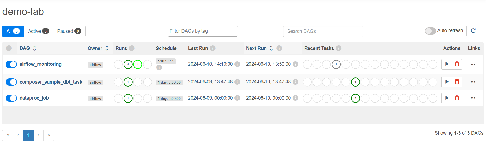

IMPORTANT ❗ ❗ ❗ Please remember to destroy all the resources after each work session. You can recreate infrastructure by creating new PR and merging it to master.


0. The goal of this phase is to create infrastructure, perform benchmarking/scalability tests of sample three-tier lakehouse solution and analyze the results using:
* [TPC-DI benchmark](https://www.tpc.org/tpcdi/)
* [dbt - data transformation tool](https://www.getdbt.com/)
* [GCP Composer - managed Apache Airflow](https://cloud.google.com/composer?hl=pl)
* [GCP Dataproc - managed Apache Spark](https://spark.apache.org/)
* [GCP Vertex AI Workbench - managed JupyterLab](https://cloud.google.com/vertex-ai-notebooks?hl=pl)

Worth to read:
* https://docs.getdbt.com/docs/introduction
* https://airflow.apache.org/docs/apache-airflow/stable/index.html
* https://spark.apache.org/docs/latest/api/python/index.html
* https://medium.com/snowflake/loading-the-tpc-di-benchmark-dataset-into-snowflake-96011e2c26cf
* https://www.databricks.com/blog/2023/04/14/how-we-performed-etl-one-billion-records-under-1-delta-live-tables.html

2. Authors:

   **Grupa nr 5**
   Piotr Kitłowski, Paweł Skierś, Kacper Królewiak

   **Link do repo: https://github.com/cncPomper/TBD**

3. Sync your repo with https://github.com/bdg-tbd/tbd-workshop-1.

4. Provision your infrastructure.

    a) setup Vertex AI Workbench `pyspark` kernel as described in point [8](https://github.com/bdg-tbd/tbd-workshop-1/tree/v1.0.32#project-setup)

    b) upload [tpc-di-setup.ipynb](https://github.com/bdg-tbd/tbd-workshop-1/blob/v1.0.36/notebooks/tpc-di-setup.ipynb) to
the running instance of your Vertex AI Workbench

5. In `tpc-di-setup.ipynb` modify cell under section ***Clone tbd-tpc-di repo***:

   a)first, fork https://github.com/mwiewior/tbd-tpc-di.git to your github organization.

   b)create new branch (e.g. 'notebook') in your fork of tbd-tpc-di and modify profiles.yaml by commenting following lines:
   ```
        #"spark.driver.port": "30000"
        #"spark.blockManager.port": "30001"
        #"spark.driver.host": "10.11.0.5"  #FIXME: Result of the command (kubectl get nodes -o json |  jq -r '.items[0].status.addresses[0].address')
        #"spark.driver.bindAddress": "0.0.0.0"
   ```
   This lines are required to run dbt on airflow but have to be commented while running dbt in notebook.

   c)update git clone command to point to ***your fork***.


6. Access Vertex AI Workbench and run cell by cell notebook `tpc-di-setup.ipynb`.

    a) in the first cell of the notebook replace: `%env DATA_BUCKET=tbd-2023z-9910-data` with your data bucket.


   b) in the cell:
         ```%%bash
         mkdir -p git && cd git
         git clone https://github.com/mwiewior/tbd-tpc-di.git
         cd tbd-tpc-di
         git pull
         ```
      replace repo with your fork. Next checkout to 'notebook' branch.

    c) after running first cells your fork of `tbd-tpc-di` repository will be cloned into Vertex AI  enviroment (see git folder).

    d) take a look on `git/tbd-tpc-di/profiles.yaml`. This file includes Spark parameters that can be changed if you need to increase the number of executors and
  ```
   server_side_parameters:
       "spark.driver.memory": "2g"
       "spark.executor.memory": "4g"
       "spark.executor.instances": "2"
       "spark.hadoop.hive.metastore.warehouse.dir": "hdfs:///user/hive/warehouse/"
  ```


7. Explore files created by generator and describe them, including format, content, total size.

   Generator wygenerował w sumie ok 9.6 Gb danych. Główny folder zawierający te dane zawiera 3 podfoldery "Batch1", "Batch2" oraz "Batch3". Dodatkowo zawiera również pliki:
   * Batch{nr}_audit.csv - plik zawierający datę początkową i końcową dla danych z poszczególnych podfolderów
   * digen_report.txt - zawiera raport całego procesu generacji danych (czas trwania, liczba rekordów itd.)
   * Generator_audit.csv - plik zawierający podsumowanie generacji

   Poszczególne podfoldery zawierają:
   * Batch1 - jest to największy z podfolderów (9.4 Gb). Zawiera on pliki w formacie textowym (rozszerzenie txt albo brak rozszerzenia), które zawierają dane tabelaryczne. Dodatkowo dla każdego pliku z danymi tabelarycznymi w folderze znajduje się plik o nazwie odpowiadającej plikowi z danymi tabularycznymi rozszerzonej o "_audit" i w formacie "csv". Te pliki zawierają natomiast interesujące statystyki z danych odpowienich tabeli np. dla danych dla kont są to min. ilość stowrzonych, usuniętych i zmodyfikowanych kont.
   * Batch2 i Batch3 - Zawierają podobny typ plików do tych w folderze Batch1, ale są dużo mniejsze oraz wszystkie pliki z danymi tabelarycznymi są w formacie txt.

8. Analyze tpcdi.py. What happened in the loading stage?

   W pliku tpcdi.py wykonywane są następujące czynności:
   1. Tworzona jest sesja, a wraz z nią baza danych która zawiera dane z których będziemy dalej korzystać
   2. Dla każdego pliku, który przetwarzamy definiowany jest schemat tabeli
   3. Stworzony schemat tabeli wykorzystywany jest do załadowania danych z plików zawierających dane (opisane w poprzednim pytaniu pliki txt i bez rozszerzenia) do tabeli bazy danych
   4. Na powstałych tabelach wykonywane są zapytania sql i tworzone są wynikowe tabele
   5. Tabele wynikowe zapisywane są do plików

9. Using SparkSQL answer: how many table were created in each layer?

   Kod:
   ```
   print("layer\t\ttable count\n---------------------------")
   for layer in ["demo_bronze", "demo_silver", "demo_gold"]:
      spark.sql(f"use {layer}")
      print(f"{layer}\t{spark.sql('show tables').count()}")
   ```
   Output:
   ```
   layer		table count
   ---------------------------
   demo_bronze	17
   demo_silver	14
   demo_gold	12

   ```

10. Add some 3 more [dbt tests](https://docs.getdbt.com/docs/build/tests) and explain what you are testing. ***Add new tests to your repository.***

   Dodaliśmy następujące testy do naszego repozytorium:
   ```
   select
      sk_account_id,
      count(sk_account_id) as cnt
   from {{ ref('dim_account') }}
   group by sk_account_id
   having cnt > 1
   ```
   Test ten sprawdza czy kolumna `sk_account_id` z tabeli `dim_account` jest unikalna
   ```
   select sk_account_id
   from {{ ref('dim_account') }}
   where sk_account_id is null
   ```
   Test ten sprawdza czy każdego wiersza z tabeli `dim_account`  kolumna `sk_account_id` nie jest nullem
   ```
   select *
   from {{ ref('dim_account') }}
   where effective_timestamp > end_timestamp
   ```
   Test ten sprawdza czy dla każdego wiersza w tabeli `dim_account` data rozpoczęcia jest wcześniejsza niż data zakończenia

11. In main.tf update
   ```
   dbt_git_repo            = "https://github.com/mwiewior/tbd-tpc-di.git"
   dbt_git_repo_branch     = "main"
   ```
   so dbt_git_repo points to your fork of tbd-tpc-di.

12. Redeploy infrastructure and check if the DAG finished with no errors:


