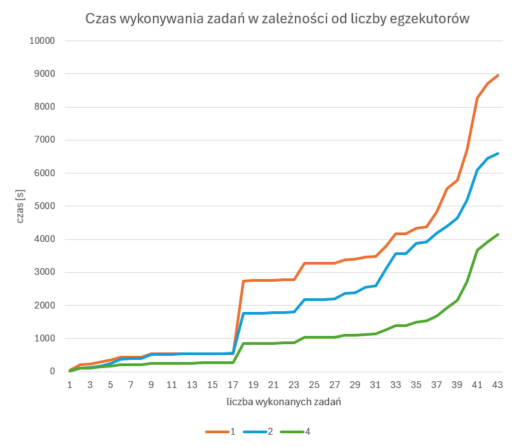

0. The goal of phase 2b is to perform benchmarking/scalability tests of sample three-tier lakehouse solution.

1. In main.tf, change machine_type at:

```
module "dataproc" {
  depends_on   = [module.vpc]
  source       = "github.com/bdg-tbd/tbd-workshop-1.git?ref=v1.0.36/modules/dataproc"
  project_name = var.project_name
  region       = var.region
  subnet       = module.vpc.subnets[local.notebook_subnet_id].id
  machine_type = "e2-standard-2"
}
```

and subsititute "e2-standard-2" with "e2-standard-4".

2. If needed request to increase cpu quotas (e.g. to 30 CPUs): 
https://console.cloud.google.com/apis/api/compute.googleapis.com/quotas?project=tbd-2023z-9918

3. Using tbd-tpc-di notebook perform dbt run with different number of executors, i.e., 1, 2, and 5, by changing:
```
 "spark.executor.instances": "2"
```

in profiles.yml.

4. In the notebook, collect console output from dbt run, then parse it and retrieve total execution time and execution times of processing each model. Save the results from each number of executors. 

5. Analyze the performance and scalability of execution times of each model. Visualize and discucss the final results.


Jak możemy zauważyć zwiększenie liczby egzekutorów zmniejsza czas potrzebny na wykonanie zadań. Warto jednak zaznaczyć, że nie jest to wzrost proporcjonalny do liczby egzekutorów, co oczywiście jest spodziewanym rezultatem. Dodatkowo, zysk z większej ilości egzekutorów jest zdecydowanie największy dla najdłuższych zadań. Dla zadań krótszych poprawa czasu wykonywania jest niewielka albo w ogóle zaniedbywalnie mała.
   