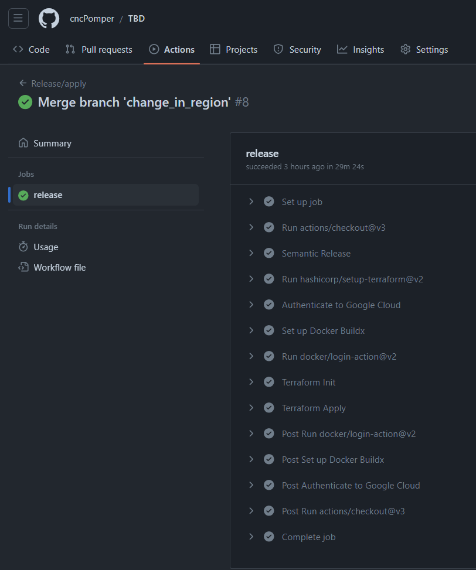
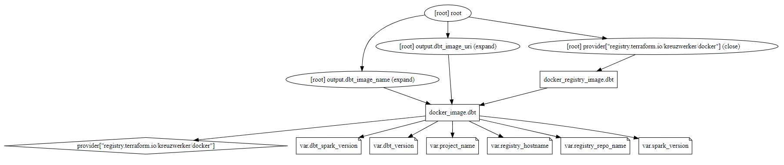
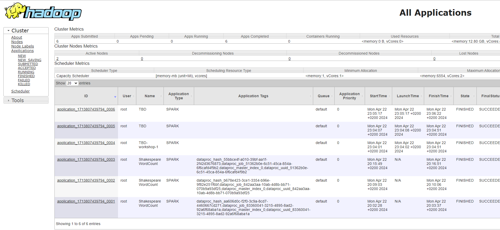
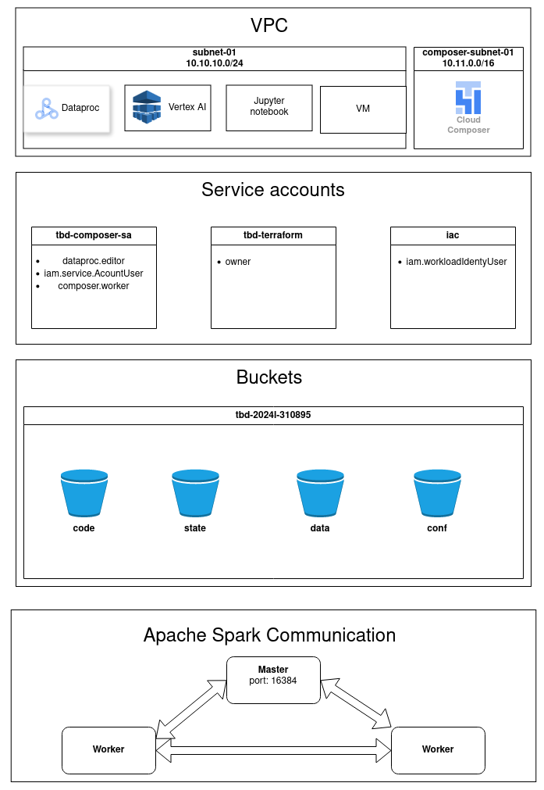
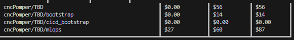
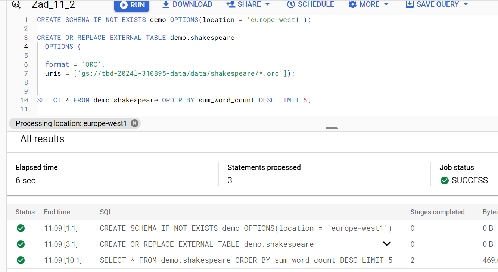
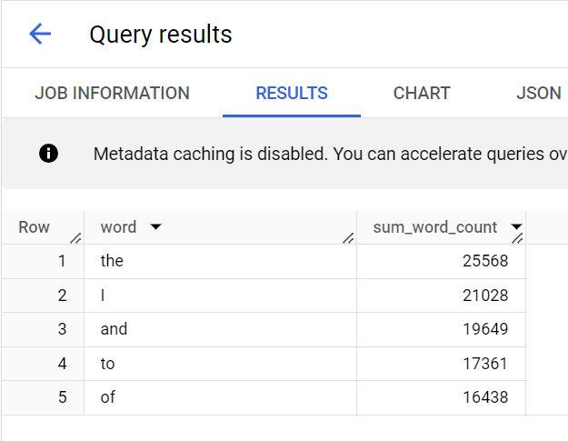
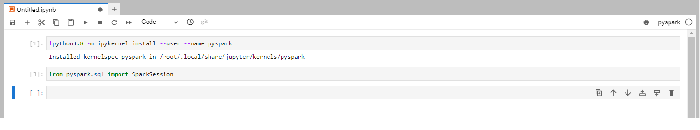

IMPORTANT ❗ ❗ ❗ Please remember to destroy all the resources after each work session. You can recreate infrastructure by creating new PR and merging it to master.


1. Authors:

   Group 5

   https://github.com/cncPomper/TBD

2. Follow all steps in README.md.

3. Select your project and set budget alerts on 5%, 25%, 50%, 80% of 50$ (in cloud console -> billing -> budget & alerts -> create buget; unclick discounts and promotions&others while creating budget).

  

5. From avaialble Github Actions select and run destroy on main branch.

7. Create new git branch and:
    1. Modify tasks-phase1.md file.

    2. Create PR from this branch to **YOUR** master and merge it to make new release.

  


8. Analyze terraform code. Play with terraform plan, terraform graph to investigate different modules.

Moduł dbt_docker_image jest skonteneryzowaną wersją data build tool. Dockerowy obraz dbt pozwala na łatwe tworzenie i zarządzanie dbt w środowisku. Moduł zawiera odniesienia do rejestru terraforma, sparka i projektu oraz dockerowy obraz dbt.

  

9. Reach YARN UI

```bash
gcloud compute ssh --zone "europe-west1-c" "tbd-cluster-m" --tunnel-through-iap -
-project "tbd-2024l-310895" -- -L 8088:localhost:8088
```

  


10. Draw an architecture diagram (e.g. in draw.io) that includes:
    1. VPC topology with service assignment to subnets
    2. Description of the components of service accounts
    3. List of buckets for disposal
    4. Description of network communication (ports, why it is necessary to specify the host for the driver) of Apache Spark running from Vertex AI Workbech

  

11. Create a new PR and add costs by entering the expected consumption into Infracost
For all the resources of type: `google_artifact_registry`, `google_storage_bucket`, `google_service_networking_connection`
create a sample usage profiles and add it to the Infracost task in CI/CD pipeline. Usage file [example](https://github.com/infracost/infracost/blob/master/infracost-usage-example.yml)

   ***place the expected consumption you entered here***
```bash
version: 0.1

google_artifact_registry_repository.registry:
    storage_gb: 50 # Total data stored in the repository in GB
    # monthly_egress_data_transfer_gb: # Monthly data delivered from the artifact registry repository in GB. You can specify any number of Google Cloud regions below, replacing - for _ e.g.:
    #   europe_west1: 10 # GB of data delivered from the artifact registry to europe-north1.


# google_storage_bucket.my_bucket:
#   storage_gb: 150                   # Total size of bucket in GB.
#   monthly_class_a_operations: 100 # Monthly number of class A operations (object adds, bucket/object list).
#   monthly_class_b_operations: 1250 # Monthly number of class B operations (object gets, retrieve bucket/object metadata).
#   # monthly_data_retrieval_gb: 5    # Monthly amount of data retrieved in GB.
#   monthly_egress_data_transfer_gb:  # Monthly data transfer from Cloud Storage to the following, in GB:
#     same_continent: 55

google_storage_bucket.mlflow_artifacts_bucket:
  storage_gb: 192                   # Total size of bucket in GB.
  monthly_class_a_operations: 100 # Monthly number of class A operations (object adds, bucket/object list).
  monthly_class_b_operations: 1250 # Monthly number of class B operations (object gets, retrieve bucket/object metadata).
  # monthly_data_retrieval_gb: 5    # Monthly amount of data retrieved in GB.
  # monthly_egress_data_transfer_gb:  # Monthly data transfer from Cloud Storage to the following, in GB:
  #   same_continent: 55


google_storage_bucket.tbd-state-bucket:
  storage_gb: 192                   # Total size of bucket in GB.
  monthly_class_a_operations: 100 # Monthly number of class A operations (object adds, bucket/object list).
  monthly_class_b_operations: 1250 # Monthly number of class B operations (object gets, retrieve bucket/object metadata).
  # monthly_data_retrieval_gb: 5    # Monthly amount of data retrieved in GB.
  # monthly_egress_data_transfer_gb:  # Monthly data transfer from Cloud Storage to the following, in GB:
  #   same_continent: 55

google_storage_bucket.tbd-code-bucket:
  storage_gb: 192                   # Total size of bucket in GB.
  monthly_class_a_operations: 100 # Monthly number of class A operations (object adds, bucket/object list).
  monthly_class_b_operations: 1250 # Monthly number of class B operations (object gets, retrieve bucket/object metadata).
  # monthly_data_retrieval_gb: 5    # Monthly amount of data retrieved in GB.
  # monthly_egress_data_transfer_gb:  # Monthly data transfer from Cloud Storage to the following, in GB:
  #   same_continent: 55

google_storage_bucket.tbd-data-bucket:
  storage_gb: 192                   # Total size of bucket in GB.
  monthly_class_a_operations: 100 # Monthly number of class A operations (object adds, bucket/object list).
  monthly_class_b_operations: 1250 # Monthly number of class B operations (object gets, retrieve bucket/object metadata).
  # monthly_data_retrieval_gb: 5    # Monthly amount of data retrieved in GB.
  # monthly_egress_data_transfer_gb:  # Monthly data transfer from Cloud Storage to the following, in GB:
  #   same_continent: 55

google_storage_bucket.notebook-conf-bucket:
  storage_gb: 192                   # Total size of bucket in GB.
  monthly_class_a_operations: 100 # Monthly number of class A operations (object adds, bucket/object list).
  monthly_class_b_operations: 1250 # Monthly number of class B operations (object gets, retrieve bucket/object metadata).
  # monthly_data_retrieval_gb: 5    # Monthly amount of data retrieved in GB.
  # monthly_egress_data_transfer_gb:  # Monthly data transfer from Cloud Storage to the following, in GB:
  #   same_continent: 55


google_service_networking_connection.private_vpc_connection:
    monthly_egress_data_transfer_gb: # Monthly VM-VM data transfer from VPN gateway to the following, in GB:
      same_region: 250                # VMs in the same Google Cloud region.
      europe: 70                      # Between Google Cloud regions within Europe.
      worldwide: 200                  # to a Google Cloud region on another continent.
```


   ***place the screenshot from infracost output here***
      

11. Create a BigQuery dataset and an external table using SQL

    ***place the code and output here***
    ```sql
      CREATE SCHEMA IF NOT EXISTS demo OPTIONS(location = 'europe-west1');

      CREATE OR REPLACE EXTERNAL TABLE demo.shakespeare
        OPTIONS (

        format = 'ORC',
        uris = ['gs://tbd-2024l-310895-data/data/shakespeare/*.orc']);


      SELECT * FROM demo.shakespeare ORDER BY sum_word_count DESC LIMIT 5;
    ```

  

  ## Query result

  

    ***why does ORC not require a table schema?***
  ### ORC nie potrzebuje schematu tabeli ponieważ sam go jest w stanie odczytać z danych wejściowych


12. Start an interactive session from Vertex AI workbench:

    ***place the screenshot of notebook here***
      

13. Find and correct the error in spark-job.py

  ### Błąd wynikał z podania złego bucketa w pliku `spark-job.py`. Żeby wychwycić ten błąd należało wejść w logi jobów dla DAG, gdzie pojawił się błąd. kubełek z 'indekse' 9900 nie istniał. Nastąpiła naprawa:
    Zmiana nazwy bucketa z defaultowego:
    DATA_BUCKET = "gs://tbd-2024l-9900-data/data/shakespeare/"
    na
    DATA_BUCKET = "gs://tbd-2024l-310895-data/data/shakespeare/"

14. Additional tasks using Terraform:

    1. Add support for arbitrary machine types and worker nodes for a Dataproc cluster and JupyterLab instance

    ***place the link to the modified file and inserted terraform code***

    3. Add support for preemptible/spot instances in a Dataproc cluster

    ***place the link to the modified file and inserted terraform code***

    3. Perform additional hardening of Jupyterlab environment, i.e. disable sudo access and enable secure boot

    ***place the link to the modified file and inserted terraform code***

    4. (Optional) Get access to Apache Spark WebUI

    ***place the link to the modified file and inserted terraform code***
